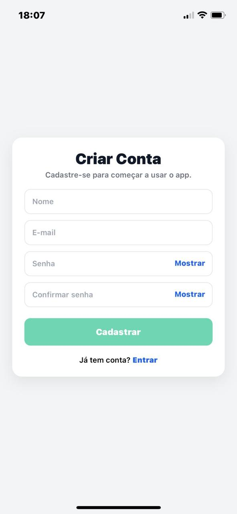
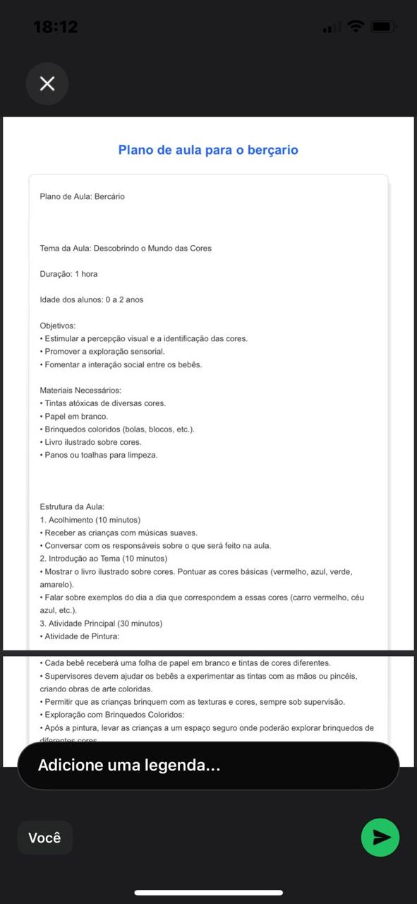

# 📚 EduIA

[](https://nodejs.org/)
[](https://expressjs.com/)
[](https://www.typescriptlang.org/)
[](https://reactnative.dev/)
[](https://expo.dev/)
[](https://www.mysql.com/)

------------------------------------------------------------------------

## 📖 Sobre o Projeto

O **EduIA** é um aplicativo educacional desenvolvido para **professores e educadores**, que integra **Inteligência Artificial** para auxiliar na criação de conteúdos pedagógicos.  
Ele permite gerar automaticamente **planos de aula, atividades, histórias, jogos, provas e recursos inclusivos**, organizando tudo em um só lugar.  

O objetivo é **otimizar o tempo do professor** e fornecer ferramentas práticas para personalizar o ensino de acordo com cada turma ou aluno.


------------------------------------------------------------------------

## 🚀 Tecnologias Utilizadas

### Backend

-   *Node.js + Express*
-   *TypeScript*
-   *MySQL* para persistência de dados
-   Arquitetura em camadas (*controllers, services, models, routes*)
-   Autenticação com *JWT*
-   *OpenAI API* geração de conteúdos com IA
-   Middlewares de segurança e tratamento de erros

### Frontend

-   *React Native + Expo + TypeScript*
-   *Expo Router* para navegação entre telas
-   *React Query (TanStack)* gerenciamento de requisições
-   *Axios* comunicação como o backend
-   *Async Storage* persistência local de sessão
-   Componentização para reutilização de UI
-   *PDF Export (Expo Print & Sharing)* exportação de conteúdos em
    PDF
-   Hooks e Context API para gerenciamento de estado

------------------------------------------------------------------------

## 📂 Estrutura do Projeto

    EDUIA/
    │── backend/                  # API e regras de negócio
    │   ├── src/
    │   │   ├── config/           # Configurações gerais (ex: banco de dados, env)
    │   │   ├── controllers/      # Camada de controle (recebe requisições)
    │   │   ├── db/               # Conexão com banco de dados
    │   │   ├── lib/              # Funções utilitárias
    │   │   ├── middlewares/      # Middlewares (ex: autenticação, logs)
    │   │   ├── models/           # Modelos de dados (MySQL + ORM/queries)
    │   │   ├── routes/           # Definição das rotas da API
    │   │   ├── services/         # Regras de negócio
    │   │   ├── app.ts            # Configuração principal do Express
    │   │   └── server.ts         # Inicialização do servidor
    │   ├── package.json
    │   └── tsconfig.json
    │
    │── frontend/                 # Aplicativo mobile (React Native)
    │   ├── app/
    │   │   ├── (auth)/           # Fluxo de autenticação (login, cadastro)
    │   │   ├── (tabs)/           # Navegação principal (abas)
    │   │   ├── contents/         # Sistema de conteúdos pedagógicos
    │   │   ├── historias/        # Histórias geradas pela IA
    │   │   ├── inclusao/         # Recursos inclusivos (deficiências, TEA, etc.)
    │   │   ├── jogos/            # Jogos educativos gerados pela IA
    │   │   ├── materiais/        # Materiais diversos
    │   │   ├── planejamento/     # Organização e planejamento pedagógico
    │   │   ├── plano-aula/       # Criação e geração de planos de aula
    │   │   ├── projetos/         # Projetos pedagógicos
    │   │   └── provas/           # Provas e avaliações
    │   ├── assets/               # Recursos estáticos (imagens, ícones)
    │   ├── components/           # Componentes reutilizáveis
    │   ├── constants/            # Constantes globais
    │   ├── hooks/                # Hooks customizados
    │   ├── layouts/              # Layouts de telas
    │   ├── lib/                  # Funções auxiliares
    │   ├── services/             # Integração com API e IA
    │   └── utils/                # Utilitários gerais
    │
    │── .gitignore
    │── README.md
    │── package.json

------------------------------------------------------------------------

## ⚙ Funcionalidades

✅ Cadastro e autenticação de usuários (professores)\
✅ Geração de conteúdos educacionais com IA\
✅ Criação de planos de aula, histórias, jogos, provas e projetos
pedagógicos\
✅ Organização modular por categorias educacionais\
✅ Exportação e compartilhamento de materiais em PDF\
✅ Estrutura expansível para novas funcionalidades

------------------------------------------------------------------------

## 📸 Screenshots


### 🔐 Autenticação
<p align="center">
  
  
</p>

#### 🏠 Home

<p align="center">
  
  
</p>

---

### 📚 Conteúdos Gerados

- **Minhas Atividades**  
  

- **Planos de Aula listados**  
  

- **Criar Plano de Aula com IA**  
  

- **Plano de Aula Gerado (detalhes)**  
  

- **Sugestão de Atividade Gerada**  
  

- **Exportação em PDF**  
  


------------------------------------------------------------------------

## 📦 Instalação

### Backend

``` bash
cd backend
npm install
npm run dev
```

### Frontend

``` bash
cd frontend
npm install
npx expo start
```

### 🔑 Configuração da OpenAI e Variáveis de Ambiente

Antes de iniciar, crie um arquivo `.env` na raiz do **backend** baseado
no `.env.example`:

``` env
PORT=3000
DB_HOST=localhost
DB_PORT=3306
DB_USER=root
DB_PASSWORD=your_password
DB_NAME=eduiadb
JWT_SECRET=your_jwt_secret
OPENAI_API_KEY=your_openai_api_key_here
```

#### 📋 Explicação das variáveis:

-   **PORT** → Porta onde o servidor backend vai rodar (padrão: `3000`)\
-   **DB_HOST** → Endereço do banco de dados MySQL\
-   **DB_PORT** → Porta do MySQL (padrão: `3306`)\
-   **DB_USER** → Usuário do banco de dados\
-   **DB_PASSWORD** → Senha do banco de dados\
-   **DB_NAME** → Nome do banco de dados usado pelo EduIA\
-   **JWT_SECRET** → Chave secreta usada para assinar e validar tokens
    JWT\
-   **OPENAI_API_KEY** → Sua chave da OpenAI (necessária para gerar
    conteúdos com IA)

⚠️ Sem configurar a variável **OPENAI_API_KEY**, os recursos de IA (como
planos de aula e atividades geradas automaticamente) **não
funcionarão**.


------------------------------------------------------------------------

## 👨‍🏫 Público-Alvo

O *EduIA* é voltado para: - Professores do ensino infantil\
- Educadores que desejam otimizar o tempo de preparação de aulas\
- Instituições que buscam inovação pedagógica com **Inteligência
Artificial**

------------------------------------------------------------------------

## 🤝 Contribuição

Sinta-se à vontade para contribuir!\
Basta abrir uma *issue* ou enviar um *pull request*.

------------------------------------------------------------------------

## 📄 Licença

Este projeto está sob a licença [MIT](./LICENSE).
